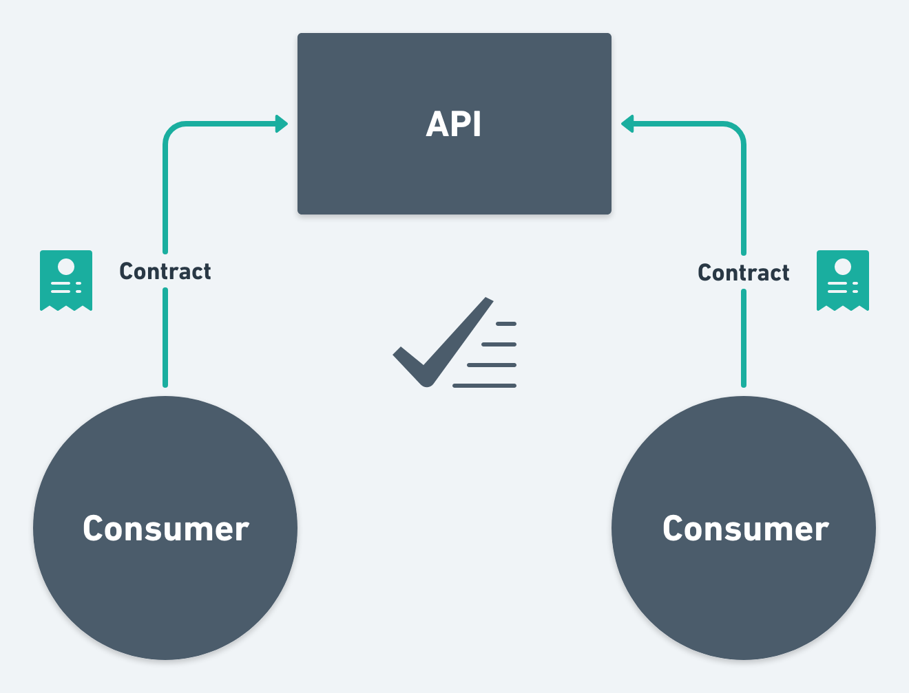
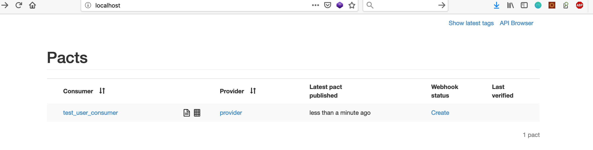

#Consumer-Driven Contract tests 

Para hablar de los test CDC antes nos tenemos que poner en contexto porque la necesidad de estos test, cuando estamos desarrollando microservicios estamos cogiendo un monolítico y partiendo en trozos más pequeños, esos *trozitos* se llama entre sí:


Como vemos en la imagen un microservicio ofrece un API y otro microservicio lo consume, ¿Qué nos ofrece los test CDC?

- [x] El microservicio consumidor genera un contrato con los campos que consume
- [x] El microservicio productor genera un contrato con los campos que produce
- [x] El *notario* que comprueba que los dos contratos sean validos

Como podemos ver en la image




El proveedor publica el contrato. El consumidor crea las pruebas para asegurarse de que tiene la interpretación correcta del contrato. En ocasiones, es posible que el consumidor no necesite usar todas la API, sino solo el subconjunto que realmente necesita para realizar el trabajo. Y, por último, el consumidor comunica estas pruebas al proveedor. Este último paso es muy importante ya que ayuda al proveedor a desarrollar las API sin interrumpir a los consumidores


## Pact.io


La jvm tenemos como impletación de CDC [pact.io](https://docs.pact.io/) en este ejemplo vamos publicar los contractos y verificar. 


## Requisitos

* Maven 3 o superior
* Java 8 o superior
* Docker 18 o superior y docker-compose 1.23.2 o superior

## Descarga del proyecto

```
git clone git@github.com:xabe/pact.git
```

## Arrancamos el pact broker

```
docker run --name pactbroker-db -e POSTGRES_PASSWORD=password -e POSTGRES_USER=postgres -e POSTGRES_DB=postgres -d postgres
docker run --name pactbroker --link pactbroker-db:postgres -e PACT_BROKER_DATABASE_USERNAME=postgres -e PACT_BROKER_DATABASE_PASSWORD=password -e PACT_BROKER_DATABASE_HOST=postgres -e PACT_BROKER_DATABASE_NAME=postgres -e PACT_BROKER_BASIC_AUTH_USERNAME=pact -e PACT_BROKER_BASIC_AUTH_PASSWORD=pact -d -p 80:80 dius/pact-broker
```

o con docker compose 

```
docker-compose up
```

## Ejecución y Comprobación

```
mvn clean install
```

